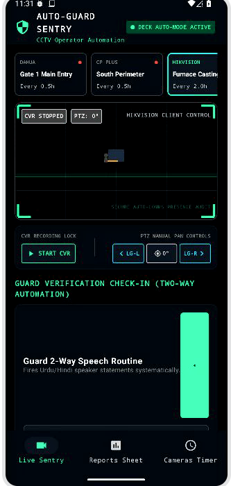
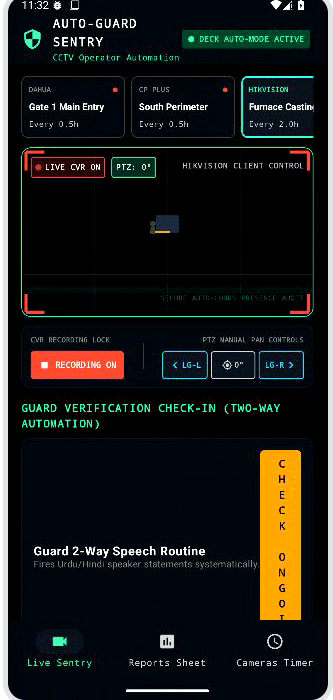
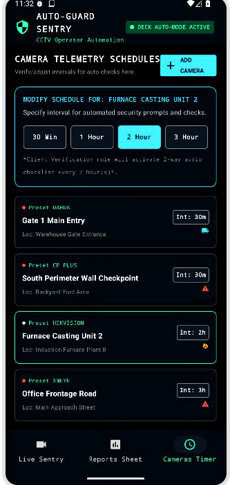
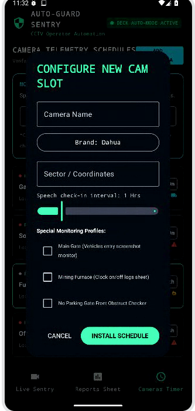
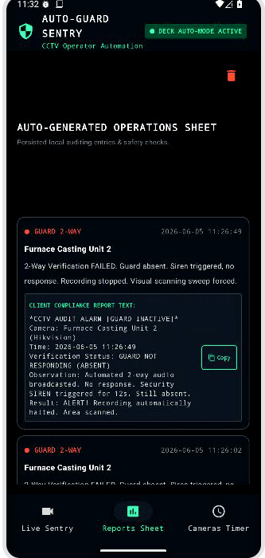

## Live Security Monitoring Dashboard

  

### Features

* Real-time CCTV monitoring interface
* Multi-camera status overview
* Live PTZ camera controls
* Camera recording controls
* Security checkpoint visualization
* Guard verification initiation
* Automated monitoring status indicators

### Purpose

This is the primary control center where operators can monitor active surveillance cameras, control PTZ movements, manage recordings, and observe security operations in real time.

---

## Two-Way Guard Communication System

  

### Features

* Automated guard check-in system
* Hindi/Urdu voice announcements
* Two-way speaker communication
* Automated guard response verification
* Scheduled security prompts
* Voice interaction logging

### Purpose

The system automatically communicates with on-site guards at scheduled intervals. Guards must respond to confirm their presence. The interaction is recorded and stored for auditing purposes.

---

## Camera Schedule Management

  

### Features

* Independent camera scheduling
* 30 Minute verification cycle
* 1 Hour verification cycle
* 2 Hour verification cycle
* 3 Hour verification cycle
* Monitoring frequency configuration

### Purpose

Each camera can be configured with its own verification schedule. This allows different security zones to receive customized monitoring frequencies based on risk level and operational requirements.

---

## New Camera Configuration

  

### Features

* Add new surveillance cameras
* Configure camera location
* Select camera manufacturer
* Assign monitoring profiles
* Define verification intervals
* Configure special monitoring rules

### Purpose

Administrators can easily deploy new cameras into the system and assign specific monitoring behaviors based on the camera's location and security responsibilities.

---

## Automated Security Reports

  

### Features

* Automated incident reports
* Guard activity logs
* Verification history
* Alert summaries
* Timestamped security records
* Audit trail generation

### Purpose

Every verification attempt is logged automatically. Clients and administrators can review security incidents, guard responses, and monitoring activity through detailed operational reports.

---

# 🖼️ Complete Application Preview

  

### Included Modules

✅ Live Monitoring Dashboard
✅ PTZ Camera Control
✅ Guard Verification System
✅ Two-Way Voice Communication
✅ Camera Scheduling Engine
✅ Automated Reporting System
✅ Incident Logging
✅ Security Audit Trail
✅ Multi-Camera Management
✅ Intelligent CCTV Automation
